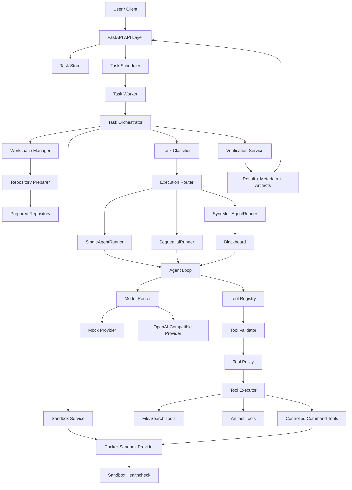
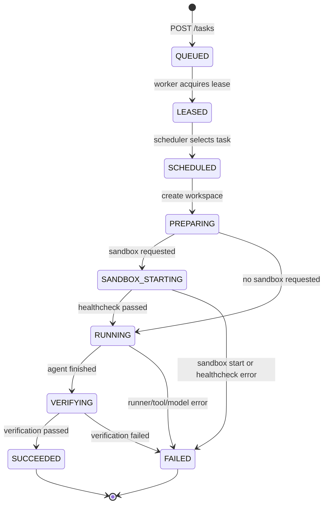
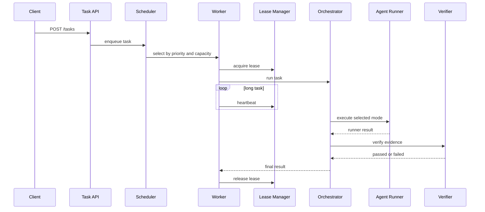
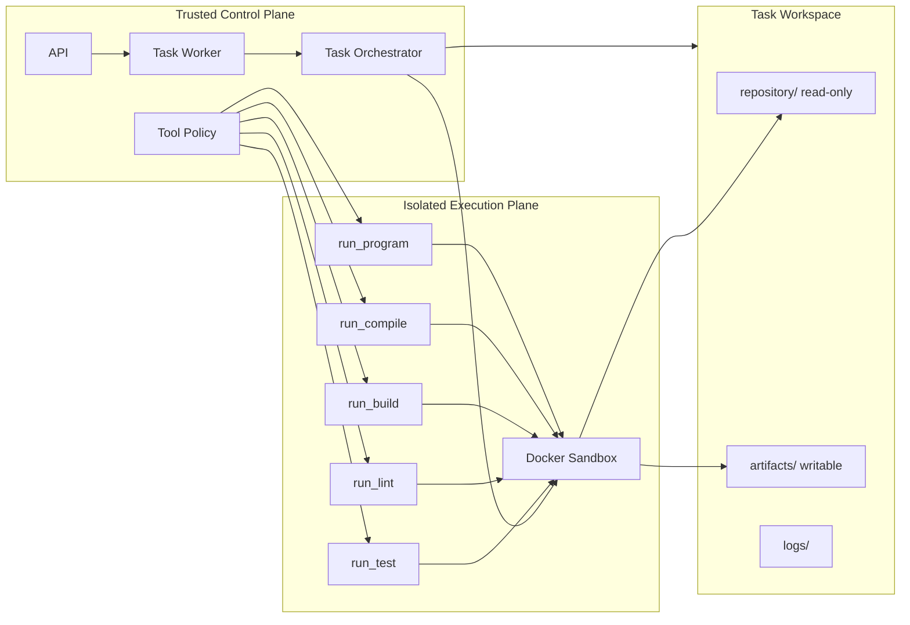
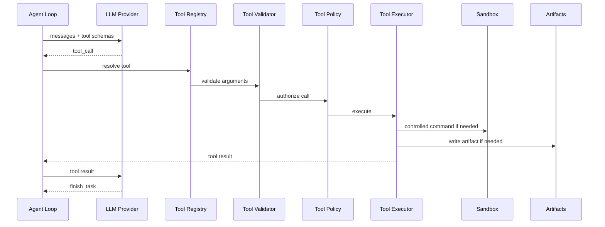
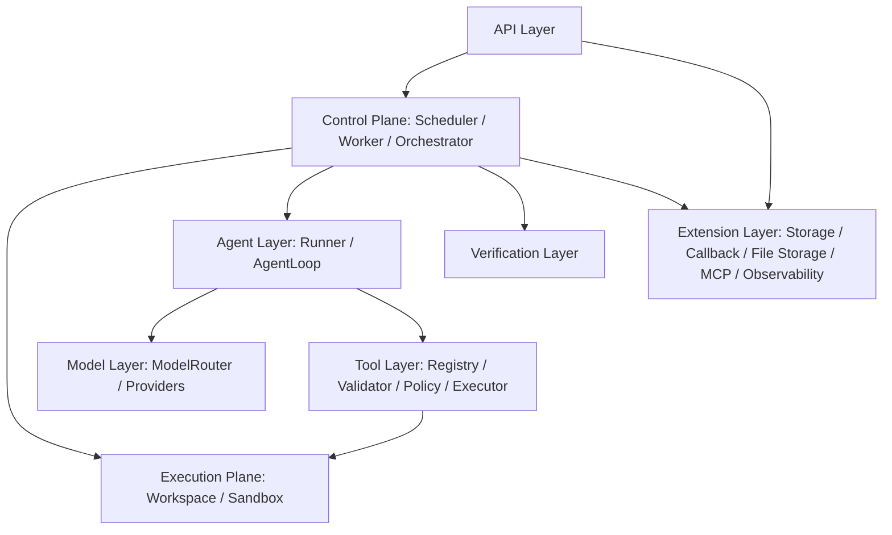

# Cloud Agent Platform 笔试提交说明

本文档用于说明本仓库如何回应笔试题目：

> 构建一个 Cloud Agent Platform。用户提交自然语言任务，例如“读取这个仓库、找出所有 TODO、生成一份报告”，平台启动自主 Agent，在云端隔离环境中执行，调用 LLM 进行推理、调用工具读写文件或执行命令，循环迭代直到完成，最后返回结果。重点包括 Agent 编排与调度、沙箱与隔离执行、LLM 集成与工具调用、整体架构与可扩展性。

仓库地址：

```text
https://github.com/zephyrzzt/Cloud-Agent-Platform-demo.git
```

## 1. 题目理解

这个题目的核心不是单独调用一次 LLM，而是搭建一个“云端 Agent 运行平台”的基础架构。平台需要接收任务、准备仓库、启动受控执行环境、让 Agent 通过工具完成任务，并在任务结束前验证结果。

因此，本项目把系统拆成两层：

- 控制面：负责 API、任务队列、调度、租约、工作区准备、沙箱生命周期、模型和工具接入、验证、状态记录。
- 执行面：负责在受控 workspace 和 sandbox 中读取仓库、运行受控命令、生成 artifact、返回报告。

当前版本是一个 GitHub-ready 的第一版平台骨架，重点完成四个方向：

- Agent 编排与调度
- 沙箱与隔离执行
- LLM 集成与工具调用
- 整体架构与可扩展性

## 2. 整体架构图



## 3. 任务生命周期图



生命周期由 `TaskOrchestrator` 和 `TaskStateMachine` 管理。API 的 `/tasks/{task_id}/events` 可以返回这些阶段对应的事件时间。

## 4. Agent 编排与调度

本项目把 Agent 任务当作平台作业处理，而不是把用户请求直接交给 LLM。任务会先进入队列，再由 Worker 领取，随后交给 Orchestrator 执行完整生命周期。

核心代码：

- `app/orchestration/task_scheduler.py`
- `app/orchestration/task_worker.py`
- `app/orchestration/execution_lease.py`
- `app/orchestration/task_orchestrator.py`
- `app/orchestration/task_state_machine.py`
- `app/orchestration/task_classifier.py`
- `app/orchestration/execution_router.py`
- `app/orchestration/runners/`

已实现能力：

- `POST /tasks` 创建任务并进入队列。
- Scheduler 支持优先级排序。
- Scheduler 支持最大并发任务数限制。
- Scheduler 支持 sandbox 任务容量限制。
- Worker 在运行任务前获取 lease。
- Worker 对长任务周期性 heartbeat，避免 lease 过期误判。
- Orchestrator 细化 README 要求的生命周期状态。
- Classifier 和 Router 根据任务类型选择 runner。
- 默认容器已经接入 `SingleAgentRunner`、`SequentialRunner`、`SyncMultiAgentRunner`。

编排流程图：



## 5. 沙箱与隔离执行

平台把可信控制面和不可信仓库执行分开。API、Scheduler、Worker、Orchestrator 运行在控制面；仓库代码和命令执行进入 workspace/sandbox 边界。

核心代码：

- `app/workspace/workspace_manager.py`
- `app/workspace/repository_preparer.py`
- `app/sandbox/models.py`
- `app/sandbox/policy.py`
- `app/sandbox/service.py`
- `app/sandbox/healthcheck.py`
- `app/sandbox/providers/docker.py`
- `app/tools/native/command_tools.py`

已实现能力：

- 每个任务有独立 workspace：`.local/workspaces/{task_id}`。
- 支持本地仓库路径和 GitHub 仓库 URL。
- 仓库会在 Agent 执行前准备到 task workspace。
- `SANDBOX_PROVIDER=docker` 时，每个任务启动一个 Docker sandbox。
- Orchestrator 负责 sandbox 创建、healthcheck、传递 sandbox id、任务结束后清理。
- 仓库目录只读挂载，artifact 目录可写挂载。
- 不暴露自由 shell 工具 `run_command`。
- 只暴露受控命令族：`run_test`、`run_lint`、`run_build`、`run_compile`、`run_program`。
- sandbox healthcheck 和 cleanup 结果会记录在 `metadata.sandbox`。

沙箱边界图：



## 6. LLM 集成与工具调用

本项目将 LLM 视为推理和决策组件，但不让模型直接操作宿主机。模型需要通过工具调用完成读文件、搜索代码、写 artifact、执行受控命令、结束任务等动作。

核心代码：

- `app/orchestration/agent_loop.py`
- `app/llm/models.py`
- `app/llm/router.py`
- `app/llm/providers/mock.py`
- `app/llm/providers/openai_compatible.py`
- `app/tools/registry.py`
- `app/tools/validator.py`
- `app/tools/policy.py`
- `app/tools/executors/`
- `app/tools/native/`

已实现能力：

- Provider-neutral 的模型请求和响应结构。
- `MockProvider` 支持无 API key 的本地确定性测试。
- `OpenAICompatibleProvider` 支持真实 `/chat/completions` 风格模型调用。
- API 支持 per-task `model_provider` 和 `model_name`。
- AgentLoop 会把工具 schema 交给模型。
- 工具调用经过 registry、validator、policy、executor。
- 工具结果回传给模型继续推理。
- 模型通过 `finish_task` 结束循环。
- Verification 会检查 artifact 或 command evidence 是否真的存在。

工具调用流程图：



## 7. 整体架构与可扩展性

项目不是把所有逻辑写在一个脚本里，而是按平台边界拆分模块。当前很多实现是 MVP 级别，例如内存存储、Docker provider、OpenAI-compatible provider，但接口边界已经预留，后续可以替换为生产组件。

项目结构：

```text
Cloud-Agent-Platform-demo/
  app/
    api/                  HTTP API, WebSocket, task/result/artifact endpoints
    bootstrap/            dependency container and lifecycle wiring
    config/               environment settings
    domain/               task, repository, conversation, event models
    orchestration/        scheduler, worker, orchestrator, runners, routing
    workspace/            task workspace and repository preparation
    sandbox/              sandbox service interface, policy, healthcheck, providers
    llm/                  provider-neutral model layer and providers
    tools/                tool registry, validation, policy, native tools, executors
    verification/         deterministic result verification
    context/              context lanes, compaction, file buffer, recall
    storage/              task, event, conversation store boundaries
    file_storage/         artifact storage boundary
    event_callback/       callback dispatch and retry boundary
    pending_messages/     frontend/client message buffering boundary
    integrations/mcp/     MCP integration boundary
    observability/        logging, metrics, tracing, audit placeholders
  docs/                   design docs and operation guide
  sandbox/                Docker sandbox image
  tests/                  pytest coverage
```

可扩展点：

- `TaskStore` 可以从 in-memory 替换成 SQLite/PostgreSQL。
- `SandboxService` 可以从 Docker 扩展到 Kubernetes 或 Firecracker。
- `ModelProvider` 可以接入 OpenAI、Anthropic、Google、local/vLLM 等 provider。
- `ToolExecutor` 可以扩展到 MCP 或远程工具执行。
- `VerificationService` 可以增加任务类型相关的验证规则。
- `ContextManager` 可以接入 AgentLoop，实现更完整的上下文压缩和召回。
- `event_callback`、`file_storage`、`pending_messages` 可以补成生产级异步服务。

分层结构图：



## 8. 当前完成度

当前仓库已经完成一个可运行的第一版平台闭环：

- FastAPI task API
- 后台 worker
- task scheduler
- lease manager 和 heartbeat
- task orchestrator 生命周期
- workspace 和 repository preparation
- Docker sandbox provider
- sandbox healthcheck 和 cleanup
- controlled command tools
- mock model provider
- OpenAI-compatible provider
- AgentLoop tool-call flow
- single/sequential/sync runner routing
- deterministic verification
- artifact API
- lifecycle events API
- pytest 覆盖
- GitHub Actions 测试 workflow

完整运行说明见 `docs/operation-flow.md`。

## 9. 如何运行

```powershell
git clone https://github.com/zephyrzzt/Cloud-Agent-Platform-demo.git
cd Cloud-Agent-Platform-demo
python -m pip install -r requirements.txt
python -m pytest -q
python -m uvicorn app.main:app --reload --host 127.0.0.1 --port 8000
```

提交一个 mock task：

```powershell
$task = Invoke-RestMethod `
  -Method Post `
  -Uri http://127.0.0.1:8000/tasks `
  -ContentType "application/json" `
  -Body '{"prompt":"Create a short MVP report.","allow_write":false}'

Invoke-RestMethod http://127.0.0.1:8000/tasks/$($task.task_id)/result
Invoke-RestMethod http://127.0.0.1:8000/tasks/$($task.task_id)/artifacts/report.md
```

## 10. 后续工作

当前未纳入第一版范围的内容统一记录在 `docs/featurework.md`，主要包括：

- 持久化数据库
- 真实 Kubernetes / Firecracker provider
- 更完整的模型 catalog 和 usage tracker
- 更完整的 MCP 接入
- 生产级 callback、file storage、pending message
- 更强的 verification 策略
- observability、metrics、tracing、audit

这些内容没有放进当前核心闭环，是为了让第一版重点聚焦在题目要求的四个方向上。
